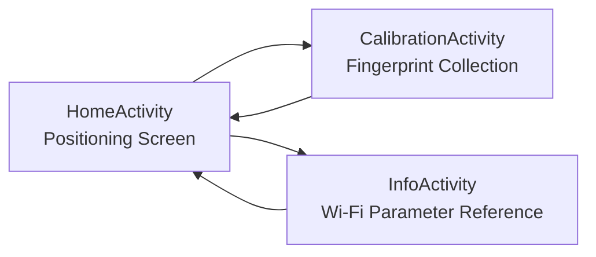
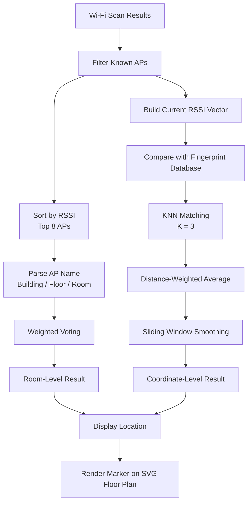
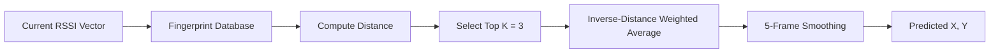
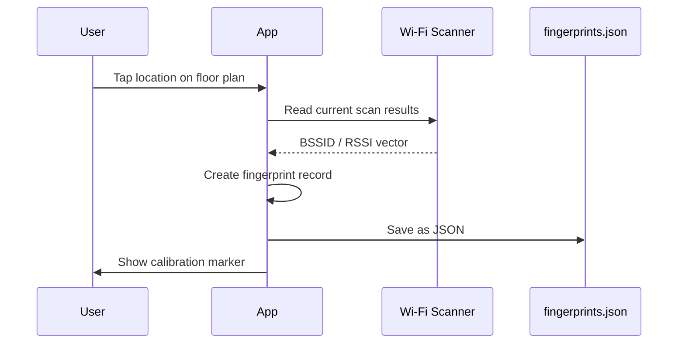

# VesselLoc · Wi-Fi Fingerprint Indoor Positioning

<p align="center">
  <strong>基于 Wi-Fi 指纹的 Android 室内定位原型应用</strong>
</p>

<p align="center">
  <em>An Android indoor positioning prototype based on Wi-Fi fingerprinting.</em>
</p>

<p align="center">
  
  
  
  
  
</p>

---

## Overview

**VesselLoc** 是一款基于 **Wi-Fi 指纹定位** 的 Android 室内定位应用，面向校园、办公楼宇、船舶等室内场景。应用通过扫描周围 Wi-Fi 接入点（Access Point, AP）的信号强度，结合 AP 命名规则、加权投票与 KNN 指纹匹配算法，实现移动端的房间级与坐标级实时定位。

> VesselLoc is an Android indoor positioning application based on Wi-Fi fingerprinting.  
> It leverages existing Wi-Fi Access Points to infer the user's indoor location in real time.

本项目最初为客轮工作人员手环室内定位场景开发，当前版本已作为技术原型归档。

---

## Screenshots

> 请将截图放入仓库的 `docs/images/` 目录，并替换下方图片路径。

| Main Screen | Coordinate Positioning | Calibration |
|---|---|---|
|  |  |  |

| Wi-Fi Dashboard | Parameter Reference | Floor Plan |
|---|---|---|
|  |  |  |

---

## Key Features

| Feature | Description |
|---|---|
| **Room-Level Positioning** | 解析 AP 命名编码，结合多 AP 信号强度加权投票，推断用户所在楼栋、楼层与房间。 |
| **Coordinate-Level Positioning** | 基于预采集 Wi-Fi 指纹数据库，使用 KNN 算法预测用户在楼层平面图上的 `(x, y)` 坐标。 |
| **Fingerprint Calibration** | 支持在楼层平面图上点击实际位置，自动采集当前位置 Wi-Fi RSSI 特征向量并保存为指纹数据。 |
| **Wi-Fi Monitoring Dashboard** | 实时展示 SSID、BSSID、IP、网关、DNS、RSSI、频段、信道、链路速率、协议版本等调试信息。 |
| **Interactive Floor Plan** | 支持 SVG 楼层图展示、双指缩放、拖拽平移，以及定位点动态叠加显示。 |
| **Bilingual Parameter Reference** | 提供 Wi-Fi 参数的中英文说明，便于调试、演示与问题排查。 |

---

## Technical Stack

| Area | Technology |
|---|---|
| Platform | Android Native |
| Language | Kotlin |
| Minimum SDK | Android 7.0 / API Level 24 |
| Target SDK | API Level 36 |
| UI Architecture | Single Activity + Multiple Screens |
| Map Rendering | WebView + Inline SVG |
| Positioning Algorithm | AP Weighted Voting + KNN Fingerprint Matching |
| Data Storage | Local JSON File |
| Floor Plan Format | SVG |

---

## Application Structure

项目主要包含三个页面：

| Screen | Responsibility |
|---|---|
| `HomeActivity` | 主定位页面，展示房间推断结果、坐标预测结果、Wi-Fi 调试信息与楼层平面图。 |
| `CalibrationActivity` | 指纹标定页面，支持点击地图采集指纹、查看与管理已采集指纹。 |
| `InfoActivity` | 参数说明页面，提供 Wi-Fi 指标的中英文释义。 |



---

## Positioning Pipeline

VesselLoc 的定位流程由两层推断组成：

1. **Room-Level Inference**  
   基于 AP 命名规则与 RSSI 加权投票，快速判断用户所在房间。

2. **Coordinate-Level Inference**  
   基于 Wi-Fi 指纹数据库与 KNN 算法，进一步预测用户在楼层图中的精确坐标。



---

## Room-Level Positioning

房间级定位依赖 AP 的统一命名规则：

```text
Building/Floor/RoomID-APNumber
```

示例：

```text
T3/1F/103AP03
```

表示：

| Field | Meaning |
|---|---|
| `T3` | T3 Building |
| `1F` | 1st Floor |
| `103` | Room 103 |
| `AP03` | Access Point No. 03 |

### Algorithm

1. 扫描当前环境中的全部 Wi-Fi AP；
2. 仅保留 MAC 地址存在于白名单中的已知 AP；
3. 按 RSSI 信号强度降序排序；
4. 选取前 8 个最强 AP；
5. 解析 AP 名称中的楼栋、楼层、房间信息；
6. 根据 RSSI 计算权重并进行投票；
7. 得分最高的房间作为当前推断结果；
8. 使用滞后防抖机制避免相邻房间频繁跳变。

权重计算方式：

```kotlin
weight = clamp(RSSI + 100, 5, 80)
```

房间切换防抖规则：

```text
newRoomScore > previousRoomScore * 1.10
```

只有当新候选房间得分超过上一结果 110% 时，才切换到新房间。

---

## Coordinate-Level Positioning

坐标级定位基于预先采集的 Wi-Fi 指纹数据库。每条指纹记录包含：

```json
{
  "x": 320.5,
  "y": 468.0,
  "rssis": {
    "00:11:22:33:44:55": -62,
    "AA:BB:CC:DD:EE:FF": -71
  }
}
```

### KNN Matching

1. 将当前扫描结果转换为 RSSI 向量；
2. 遍历指纹数据库中的所有历史指纹；
3. 在当前向量与指纹向量的 BSSID 交集上计算欧氏距离平方和；
4. 选取距离最小的 `K = 3` 条指纹；
5. 使用距离倒数作为权重，对坐标进行加权平均；
6. 使用 5 帧滑动窗口对输出坐标进行平滑。



---

## Fingerprint Collection

应用提供专用标定模式，用于构建 Wi-Fi 指纹数据库。

### Calibration Workflow

1. 用户进入 `CalibrationActivity`；
2. 在 SVG 楼层平面图上点击实际所在位置；
3. 系统读取当前可探测 AP 的 BSSID 与 RSSI；
4. 将点击坐标与 RSSI 向量组合为一条指纹记录；
5. 指纹数据以 JSON 格式保存到本地；
6. 标定点会同步显示在地图上。



---

## Wi-Fi Scan Scheduling

为兼顾定位实时性与 Android 系统的 Wi-Fi 扫描限频策略，应用采用主动扫描、缓存轮询与广播监听结合的调度机制。

| Mechanism | Interval / Rule | Purpose |
|---|---:|---|
| Active Scan | Every 5 seconds | 调用 `WifiManager.startScan()` 主动发起扫描。 |
| Result Polling | Every 1 second | 读取 `wifiManager.scanResults` 缓存并检查是否有新结果。 |
| Staleness Threshold | 12 seconds | 超过 12 秒的扫描结果视为 stale，不参与定位。 |
| Manual Refresh Cooldown | 12 seconds | 防止手动刷新过于频繁导致系统拒绝。 |
| Broadcast Receiver | `SCAN_RESULTS_AVAILABLE_ACTION` | 作为扫描完成的补充通知通道。 |

---

## AP Mapping

项目中维护了两类 AP 映射数据。

| Component | Responsibility |
|---|---|
| `ApNameMapping` | 维护 MAC 地址到可读 AP 名称的映射，用于解析楼栋、楼层与房间信息。 |
| `ApRoomMapping` | 维护已知 AP 的 MAC 地址白名单，用于过滤无关扫描结果。 |

当前示例数据覆盖 T3、T6、T7、T8 等楼栋中的约 20 个 AP。

AP 命名规范：

```text
Building/Floor/RoomID-APNumber
```

Example:

```text
T3/1F/103AP03
```

---

## Floor Plan Rendering

楼层平面图采用 SVG 格式，并通过 WebView 渲染。

### Rendering Strategy

- 使用 WebView 加载内联 HTML 与原始 SVG；
- SVG 画布尺寸为 `855 × 815`；
- 自动处理 `preserveAspectRatio`、白底去除、暗色背景适配等兼容性问题；
- 使用 `WebView.evaluateJavascript()` 动态向 SVG DOM 注入或移除定位标记；
- 通过 `requestDisallowInterceptTouchEvent` 解决 WebView 与外层 ScrollView 的触摸冲突；
- 支持双指缩放与拖拽平移。

定位点通过动态注入 SVG `<circle>` 元素实现：

```html
<circle cx="320.5" cy="468.0" r="8" />
```

---

## Strengths

| Strength | Description |
|---|---|
| **Dual-Layer Positioning** | 房间级定位与坐标级定位并行工作，既能快速给出房间结果，也能在有指纹数据区域提供更精细坐标。 |
| **Debounce & Smoothing** | 房间推断使用 10% 滞后阈值，坐标输出使用 5 帧滑动窗口，有效减少跳变。 |
| **Android Compatibility** | 适配 Android API 24–36，对权限模型、位置服务依赖、扫描限频策略进行了兼容处理。 |
| **Rich Diagnostics** | 实时展示 `startScan()` 返回值、连续失败次数、扫描结果新鲜度等底层状态，便于问题排查。 |
| **Local Prototype Friendly** | 指纹库与 AP 映射均可本地维护，适合原型验证、小范围试点与教学演示。 |

---

## Limitations & Future Work

| Limitation | Possible Improvement |
|---|---|
| AP 映射当前为硬编码配置 | 迁移至 JSON 配置文件、远程配置或服务端下发。 |
| 指纹库依赖人工逐点采集 | 引入众包采集、半监督更新或自动校准机制。 |
| 当前仅支持单张楼层平面图 | 支持多建筑、多楼层地图动态切换。 |
| KNN 为基准算法 | 引入高斯过程回归、粒子滤波等更鲁棒的概率模型。 |
| 数据仅存储在本地 | 支持跨设备指纹库同步与云端协同更新。 |
| 尚未在真实船舶环境部署 | 后续可迁移至 Wear OS，并在实际客轮环境中进行测试。 |

---

## Applicable Scenarios

VesselLoc 当前适合用于以下场景：

- 校园教学楼、办公楼内的人员实时定位；
- 室内导航应用的基础定位能力验证；
- Wi-Fi 指纹定位算法的原型研究；
- Android Wi-Fi 扫描与定位能力演示；
- 小范围室内定位试点部署；
- 可穿戴设备室内定位方案的前期验证。

---

## Project Status

本项目最初为客户定制开发，目标场景为 **客轮上工作人员的手环室内定位**。

项目名 **VesselLoc** 来源于：

```text
Vessel + Loc
```

即：

```text
Ship / Vessel + Location
```

由于原客户项目中止，本应用未进入正式交付阶段。当前代码已停止主动开发，并作为 Wi-Fi 指纹室内定位技术原型进行归档。

### Current State

| Item | Status |
|---|---|
| Development | Archived |
| Platform | Android Native |
| Language | Kotlin |
| Target Device | Android phone; planned migration to Wear OS if resumed |
| Test Environment | Office floor plan data |
| Real Vessel Deployment | Not deployed |
| Data Type | Sample AP mappings and fingerprint data |
| Maintenance | No active maintenance |

---

## Repository Notes

当前仓库中的 AP 映射、指纹库与楼层图数据均为开发与测试阶段录入的示例数据。

如需迁移到新的室内场景，需要重新配置：

1. AP MAC 地址白名单；
2. AP 可读名称映射；
3. 楼层 SVG 平面图；
4. 指纹采集点；
5. Android 权限与 Wi-Fi 扫描策略适配。

---

## Roadmap

- [ ] 支持多楼栋、多楼层地图切换
- [ ] 将 AP 映射迁移为外部配置文件
- [ ] 支持指纹库导入与导出
- [ ] 增加云端指纹同步能力
- [ ] 支持 Wear OS 可穿戴设备
- [ ] 引入更鲁棒的定位算法
- [ ] 增加定位误差评估与可视化报告

---

## License

本项目当前未指定开源许可证。

如需用于商业、研究或二次开发，请先确认代码与数据的授权范围。

---

## Acknowledgements

VesselLoc was developed as a technical prototype for Wi-Fi fingerprint-based indoor positioning.  
It demonstrates how existing Wi-Fi infrastructure can be used for room-level and coordinate-level indoor localization on Android devices.
